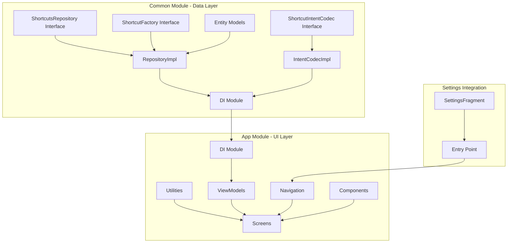

# Shortcuts V2 - Consolidated PR Plan

## Overview
This document outlines the plan for breaking down the shortcuts v2 implementation into **8 reviewable partial PRs** (consolidated from 16). Each PR is designed to be self-contained, reviewable, and not break the build.

## Architecture



## PR Breakdown (8 PRs)

### PR 1: Common Data Layer - Foundation
**Branch:** `feature/shortcuts-v2-data-foundation`
**Files:**
```
common/src/main/kotlin/io/homeassistant/companion/android/common/data/shortcuts/
├── ShortcutsRepository.kt
├── ShortcutFactory.kt
├── ShortcutIntentCodec.kt
├── di/ShortcutsRepositoryModule.kt
└── impl/entities/
    ├── ShortcutDraft.kt
    ├── ShortcutResult.kt
    ├── ShortcutTargetValue.kt
    ├── EditorData.kt
    ├── ServerData.kt
    └── ShortcutsListData.kt
```
**Dependencies:** None (foundational)
**Description:** 
- Core interfaces, data models, and DI module
- Defines the contract for the entire feature
- No implementation logic yet
**Review Focus:**
- Data model design
- Interface contracts
- Type safety
- DI configuration

---

### PR 2: Common Data Layer - Implementation
**Branch:** `feature/shortcuts-v2-data-impl`
**Files:**
```
common/src/main/kotlin/io/homeassistant/companion/android/common/data/shortcuts/impl/
├── ShortcutsRepositoryImpl.kt
├── MockShortcutsRepositoryImpl.kt
└── ShortcutIntentCodecImpl.kt
```
**Dependencies:** PR 1
**Description:**
- Real repository implementation with ShortcutManagerCompat integration
- Intent codec for encoding/decoding shortcut data
- Mock implementation for testing/development
**Review Focus:**
- Repository pattern adherence
- Android ShortcutManager integration
- Encoding/decoding logic
- Legacy migration handling
- Error handling

---

### PR 3: App Module - DI and Factory
**Branch:** `feature/shortcuts-v2-app-di`
**Files:**
```
app/src/main/kotlin/io/homeassistant/companion/android/settings/shortcuts/v2/
└── di/
    ├── ShortcutsModule.kt
    └── WebViewShortcutFactory.kt
```
**Dependencies:** PR 1, PR 2
**Description:**
- App-level Hilt DI module
- WebView-specific shortcut factory implementation
- Binds repository and factory implementations
**Review Focus:**
- DI wiring correctness
- Factory implementation
- WebView intent construction

---

### PR 4: App Module - Utilities and Navigation
**Branch:** `feature/shortcuts-v2-utils-nav`
**Files:**
```
app/src/main/kotlin/io/homeassistant/companion/android/settings/shortcuts/v2/
├── util/ShortcutIconRenderer.kt
└── navigation/ShortcutsNavigation.kt
```
**Dependencies:** PR 3
**Description:**
- Icon rendering utilities for shortcuts
- Navigation graph and route definitions
**Review Focus:**
- Bitmap generation and icon scaling
- Navigation structure
- Type-safe routes

---

### PR 5: App Module - ViewModels
**Branch:** `feature/shortcuts-v2-viewmodels`
**Files:**
```
app/src/main/kotlin/io/homeassistant/companion/android/settings/shortcuts/v2/
├── ManageShortcutsViewModel.kt
└── EditShortcutViewModel.kt
```
**Dependencies:** PR 2, PR 3
**Description:**
- Business logic for UI
- State management with StateFlow
- Repository interactions
**Review Focus:**
- MVVM pattern
- State flow handling
- Error states
- Action handling

---

### PR 6: App Module - UI (Screens, Components, Previews, Strings)
**Branch:** `feature/shortcuts-v2-ui`
**Files:**
```
app/src/main/kotlin/io/homeassistant/companion/android/settings/shortcuts/v2/views/
├── screens/
│   ├── ShortcutsListScreen.kt
│   ├── ShortcutEditorScreen.kt
│   ├── ShortcutEditorScreenState.kt
│   ├── ShortcutEditAction.kt
│   └── ShortcutDraftSaver.kt
├── components/
│   ├── AppShortcutEditor.kt
│   ├── HomeShortcutEditor.kt
│   ├── ShortcutEditorForm.kt
│   ├── EmptyStateContent.kt
│   └── ErrorStateContent.kt
├── selector/
│   └── ShortcutIconPicker.kt
└── preview/
    └── ShortcutPreviewData.kt
common/src/main/res/values/strings.xml (v2 strings only)
```
**Dependencies:** PR 4, PR 5
**Description:**
- All UI components consolidated
- Screens, forms, and reusable components
- Preview data for Compose previews
- String resources for v2 feature
**Review Focus:**
- Compose UI patterns
- State hoisting
- Component composition
- Design system usage
- Preview completeness
- String resource naming

---

### PR 7: App Module - Fragment and Settings Integration
**Branch:** `feature/shortcuts-v2-integration`
**Files:**
```
app/src/main/kotlin/io/homeassistant/companion/android/settings/
├── shortcuts/v2/ManageShortcutsSettingsFragment.kt
└── SettingsFragment.kt
```
**Dependencies:** PR 6
**Description:**
- Fragment container for shortcuts UI
- Settings entry point integration
- Preference click handling for v2
**Review Focus:**
- Fragment lifecycle
- Compose integration
- Settings navigation
- Entry point wiring

---

### PR 8: Tests (Unit and Screenshot)
**Branch:** `feature/shortcuts-v2-tests`
**Files:**
```
app/src/test/kotlin/io/homeassistant/companion/android/settings/shortcuts/v2/
├── ManageShortcutsViewModelTest.kt
└── EditShortcutViewModelTest.kt
app/src/screenshotTest/kotlin/io/homeassistant/companion/android/settings/shortcuts/v2/views/screens/
├── ShortcutEditorScreenScreenshotTest.kt
└── ShortcutsListScreenScreenshotTest.kt
```
**Dependencies:** PR 5, PR 6
**Description:**
- Unit tests for ViewModels
- Screenshot tests for UI validation
**Review Focus:**
- Test coverage
- Mock usage
- State verification
- Screenshot variations

---

## Dependency Graph

```
PR 1 (Data Foundation)
    │
    ▼
PR 2 (Data Implementation)
    │
    ├──► PR 3 (App DI & Factory)
    │       │
    │       ├──► PR 4 (Utils & Navigation)
    │       │       │
    │       │       └──► PR 6 (UI Components) ◄──┐
    │       │               │                    │
    │       └──► PR 5 (ViewModels) ──────────────┤
    │                       │                    │
    │                       └──► PR 8 (Tests) ◄──┘
    │
    └──► PR 7 (Integration) ◄── PR 6
```

## Build Verification Checklist

Each PR should verify:
- [ ] `./gradlew ktlintCheck` passes
- [ ] `./gradlew test` passes
- [ ] `./gradlew assembleDebug` succeeds
- [ ] No breaking changes to existing functionality

## Feature Flag Strategy

Until PR 7, the feature is hidden behind:
1. The DI module uses `MockShortcutsRepositoryImpl`
2. The settings preference for v2 is available but uses mock data

After PR 7, the feature becomes accessible through the settings menu.

## Rollback Plan

If issues are discovered:
1. PR 7 can be reverted to hide the feature
2. PR 3 can be reverted to switch back to mock implementation
3. Individual PRs can be reverted in reverse order if needed

## PR Summary Table

| PR | Description | Files | Dependencies | Review Focus |
|----|-------------|-------|--------------|--------------|
| 1 | Data Foundation | 10 | None | Interfaces, models, DI |
| 2 | Data Implementation | 3 | PR 1 | Repository, codec |
| 3 | App DI & Factory | 2 | PR 1, 2 | DI wiring, factory |
| 4 | Utils & Navigation | 2 | PR 3 | Icons, navigation |
| 5 | ViewModels | 2 | PR 2, 3 | Business logic |
| 6 | UI Components | 12 | PR 4, 5 | Compose UI |
| 7 | Integration | 2 | PR 6 | Fragment, settings |
| 8 | Tests | 4 | PR 5, 6 | Unit & screenshot |
